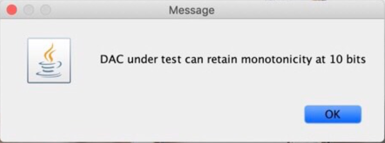

# DAClinearityTest
Test DACs' linearity performance using the Analog Shield 

#### Current progress and difficulty of the project
To test linearity of a DAC, direct access to the DAC is necessary. However, each DAC has a different configuration of pins and package. Thus, an interfacing hardware has to be developed to accomodate the DAC under test. Thus, the driver software also has to be specific to certain type of DAC. 

#### For in-depth explanation of this project, read "explanation.pdf"
The goal of this project is to provide user with a low-cost way to test DACs to prevent counterfeited electronics parts. This testing method can be used to test 16 bit DAC. 

This project tests the static performance of the DAC. If you are interested in dynamic linearity test, check out my other project "DACTest"
#### Hardware requirement: 
 - Arduino UNO
 - Analog Shield by standford university
 - Windows/Mac/Linux computer

 
#### Software interface: 

#### Setup: 
 - The firmware(will be uploaded soon) should first be installed on the Arduino
 - Connect the Arduino with Analog Shield attached to the PC via USB, on the Software interface, select the serial port and click connect. 
#### Max bits with 100% monotonicity
 - What it means?
   - A DAC is only monotonic to certain level of precision. For a 8bit DAC can output 255 level of voltage, increasing monotonically in voltage from the lowest to highest. However, mononicity breaks when the voltage output decreases rather than increases although the DAC "is told to" output at a higher voltage level. 
   - This feasure of the software finds the maximum level of precision of the DAC in terms of number of bits. At such level of precision, the DAC is guareenteed to have 100% monotonicity. 
 - Sample output from a testing session of a high quanlity DAC. 
 

#### Test INL performance at selected bits
 - What it means?
   - INL is also a measurement of monotonicity, INL error can produce spurs on the frequency spectrum.
   - The software sweeps through the DAC's output level from the lowest to highest at selected inverval. The output of the DAC is compared to the ideal perfectly straight line on a plot
    
 - Sample output: 
 
 
 #### Graph non-monotonic region
 - What it means?
   - A particular DAC typically has some non-monotonic region. This feature of the tool displays the "location" of the non-monotonic region.
   - The amount of non-monotonic region will increase as the voltage-output-increment-interval gets smaller.
   - Monotonicity is directly related to the ENOB, effective number of bits, of a DAC.
    
 - Sample output: 
 
 
 